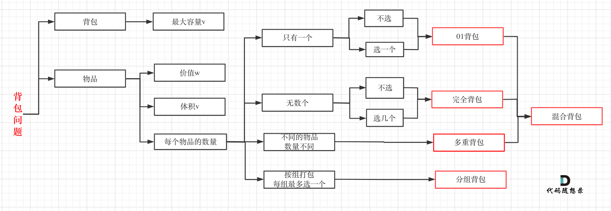

# 背包问题

关于这⼏种常⻅的背包，其关系如下：

按照如下五部来逐步分析

1. 确定dp数组（dp table）以及下标的含义
2. 确定递推公式
3. dp数组如何初始化
4. 确定遍历顺序
5. 举例推导dp数组

## 背包递推公式

问能否能装满背包（或者最多装多少）此时商品重量和商品价值相等：dp[j] = max(dp[j], dp[j - nums[i]] + nums[i]); 对应题⽬如下：

* 动态规划：416.分割等和⼦集
* 动态规划：1049.最后⼀块⽯头的重量 II

问装满背包有⼏种⽅法，实际上是不同维度的相加：dp[j] += dp[j - nums[i]]
对应题⽬如下：

* 动态规划：494.⽬标和
* 动态规划：518. 零钱兑换 II
* 动态规划：377.组合总和Ⅳ
* 动态规划：70. 爬楼梯进阶版（完全背包）

问背包装满最⼤价值，最常规：dp[j] = max(dp[j], dp[j - weight[i]] + value[i]); 对应题⽬如下：

* 动态规划：474.⼀和零

问装满背包所有物品的最⼩个数，商品价值为1求最小价值：dp[j] = min(dp[j - coins[i]] + 1, dp[j]); 对应题⽬如下：

* 动态规划：322.零钱兑换
* 动态规划：279.完全平⽅数

## 遍历顺序

**01背包**

⼀维dp数组01背包只能先遍历物品再遍历背包容量，且第⼆层for循环是从**⼤到⼩**遍历

**完全背包**

先遍历物品还是先遍历背包都是可以的，且第⼆层for循环是从**⼩到⼤**遍历，和01背包在于第二层只放一次不会重复放

但是如果求**组合数**就是外层for循环遍历物品，内层for遍历背包，如果求**排列数**就是外层for遍历背包，内层for循环遍历物品。二者区别在于物品是否重复放
